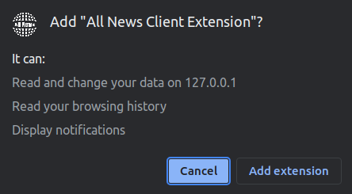
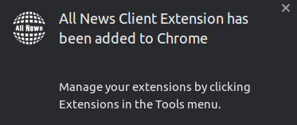
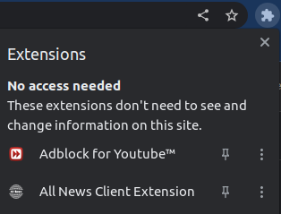
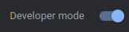
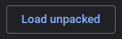
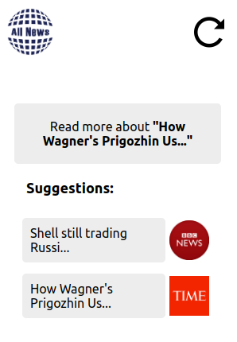

# All News Project Google Extension

## Description

Google extension that by reading an article in specific news website the extension will connect by the API to the server and request to check if there are more articles with the same subject that the server already classified in the database, also the extension will suggest to the user to read the same article in different websites.

## Installation

### Method 1 (Using packed `.crx` file)

1. Download from [releases](https://github.com/all-news-project/extension/tags) the `.crx` file from the version you want.

2. Go to `chrome://extensions/` url in Google Chrome browser.

3. Drag & Drop the `.crx` file into your browser window.

4. Click on `Add extension` button in the window that opened: <br><br> 

5. You can see the message: <br><br> 

6. [Optional] You can choose to pin the extension to the browser panel by clicking the pin icon: <br><br> 

### Method 2 (Load unpacked with developer mode)

1. Clone this repo to your machine using: ```git clone https://github.com/all-news-project/extension.git```.

2. Go to `chrome://extensions/` url in Google Chrome browser.

3. Check the `Developer mode` in the top right corner of the extensions page: <br><br> .

4. Click the `Load unpacked` button in the top left corner of the extensions page: <br><br> .

5. Choose the folder of the repository you cloned.

6. [Optional] You can choose to pin the extension to the browser panel by clicking the pin icon: <br><br> 

## How to use the extension

When you are in news website (that are in this list) and you want to check if there more news article with the same subject you can open the extension and click the refresh button, now you have four different options:

1. If the website you using is not valid (the system is not scraping the articles from it) you will get the message: `Current website is not valid domain`.

2. If there was a technical problem to show the response from the server API you will get the message: `Error showing news articles, Please try again...`.

3. If you are using valid website but there was not found other classified articles you will get the message: `Didn't find similar articles`.

4. If there exists classified news articles at the server you will see the suggestions of other article, for example: <br><br> 